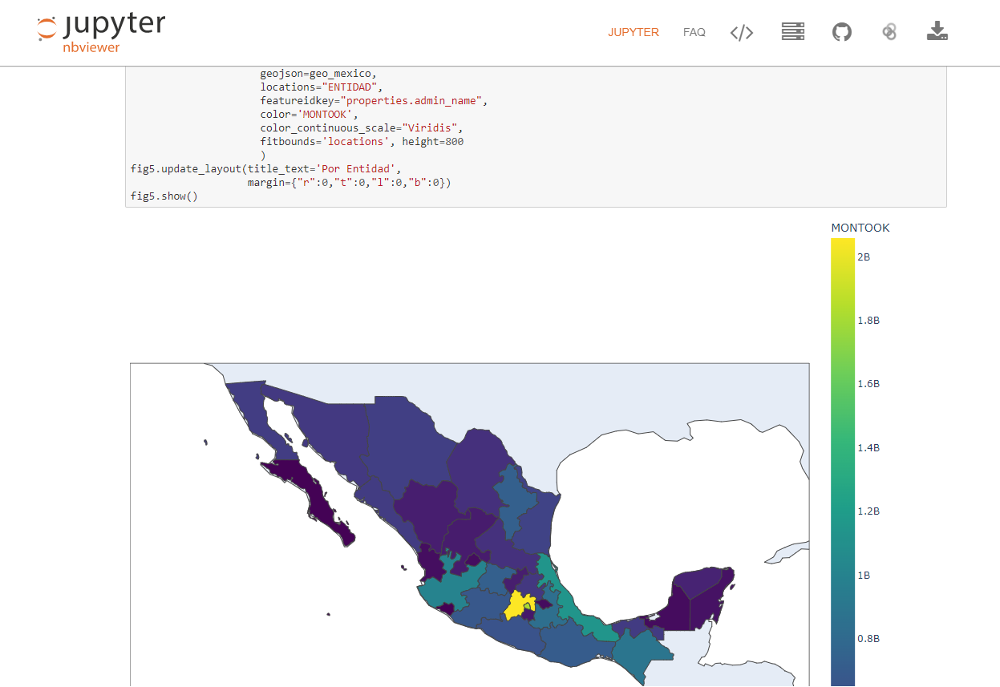
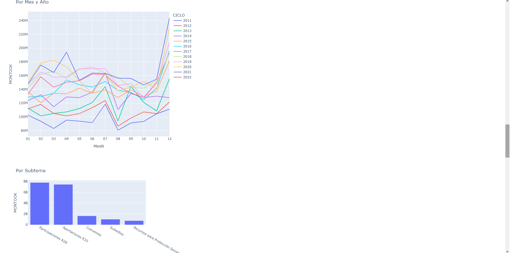
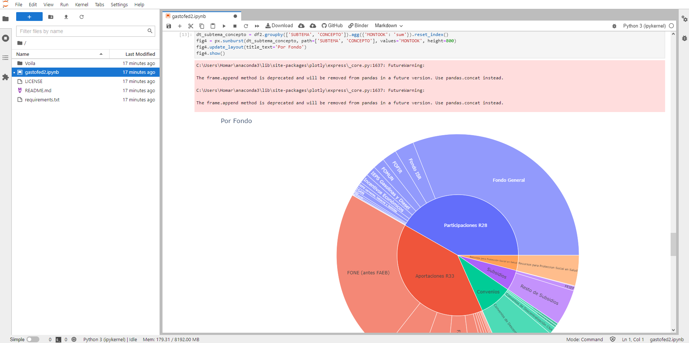
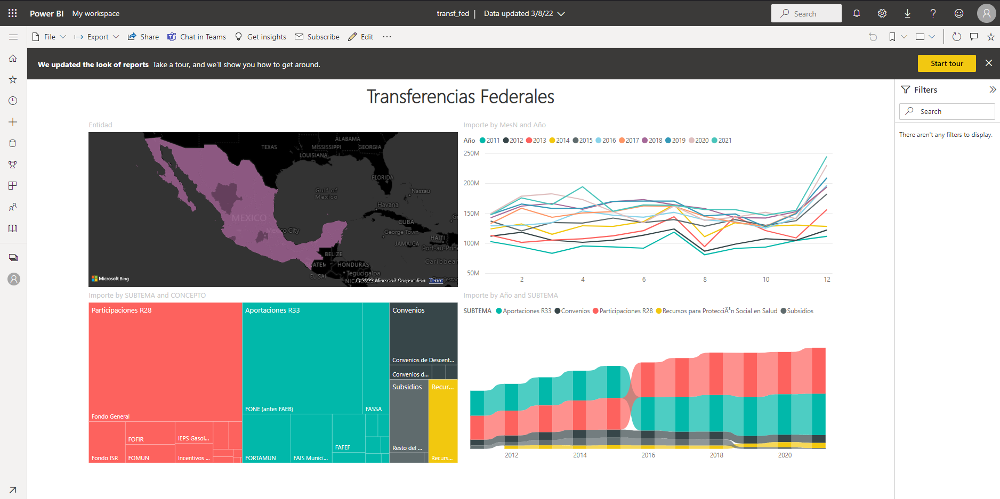
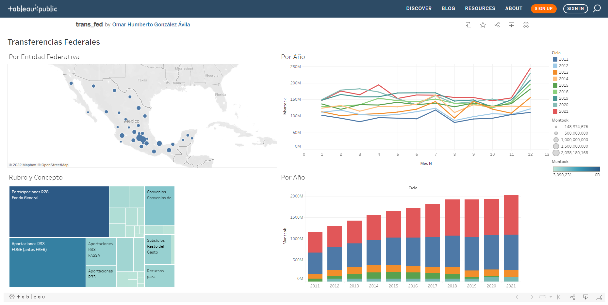
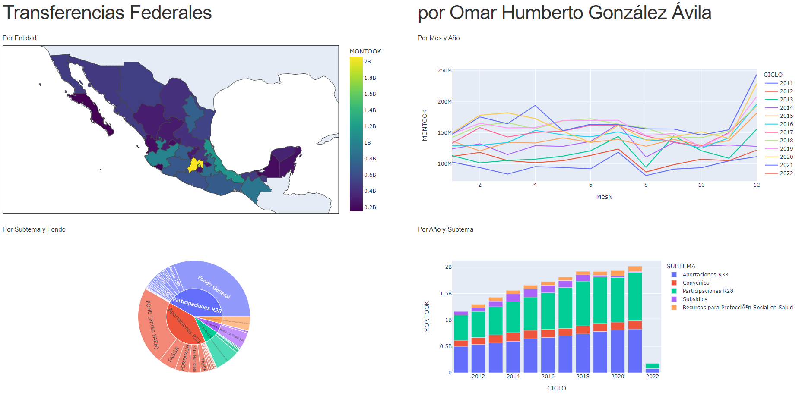

> Mucho se perdió entonces y pocos viven ahora para recordarlo. Todo comenzó con la forja de los Grandes Anillos. Tres fueron entregados a los Elfos inmortales, los más sabios y
bellos de todos los seres. Siete a los señores Enanos. Grandes mineros y artesanos de las cavidades montañosas. Y Nueve... Nueve fueron entregados a la raza de los hombres... Que ansían
por encima de todo el Poder. En aquellos anillos residía el poder y la voluntad para gobernar a cada raza. Pero todos ellos fueron engañados... Pues otro Anillo más fue forjado... En la tierra de Mordor, en los fuegos del Monte del destino, el Señor Oscuro Sauron forjó en secreto el Anillo Regente para controlar a todos los demás. En ese Anillo descargó toda su crueldad, su malicia y su voluntad de dominar todo tipo de vida... Un Anillo para gobernarlos a todos. 

## 1. Introducción

Este proyecto tiene su origen en que quiero construir un tablero dashboard que contenga diferentes gráficas y elementos que sirvan para analizar los datos. Busco interactividad, buenas gráficas, mapas y más cosas que no se encuentran en un procesador de textos ni en una hoja de cálculo. Sin embargo, ante la diversidad de herramientas que existen, la principal dificultad que he tenido ha sido encontrar un dashboard que tenga todos los elementos que busco. **Un *dashboard* para gobernarlos a todos.**

Si bien esta idea no es original, como puede verse [aquí](https://www.datarevenue.com/en-blog/data-dashboarding-streamlit-vs-dash-vs-shiny-vs-voila), quiero mostrar la misma información a través de diferentes herramientas, es decir, comparar los tableros que se generan con cada una y su uso.

Para este ejercicio, decidí hacer el tablero con una fuente de datos abiertos pública, y me gustó la base de datos de Transferencias del Gobierno Federal a Entidades Federativas y Municipios, de la Secretaria de Hacienda y Crédito Público del Gobierno de México disponible [aquí](http://presto.hacienda.gob.mx/EstoporLayout/baseDatos.jsp). Me gusta porque su base de datos está en formato csv con liga directa [aquí](https://www.secciones.hacienda.gob.mx/work/models/estadisticas_oportunas/datos_abiertos_eopf/transferencias_entidades_fed.csv), por lo que pude realizar este análisis de manera sencilla. Vayamos a los candidatos.

## 2. Jupyter. 

En si, Jupyter no es una herramienta para dashboards, es más bien una herramienta técnica para programación, análisis de datos, y muchas otras cosas; y para usarla de manera apropiada, requiere instalación de paquetes técnicos como [*Anaconda*](https://www.anaconda.com) o la reciente aplicación [*JupyterLab Desktop*](https://github.com/jupyterlab/jupyterlab-desktop).

Sin embargo, existen herramientas como [*NBViewer*](https://nbviewer.org) donde se pueden ver *notebooks* en línea, relativamente interactivas, por lo cual, la consideré como un candidato para este ejercicio. Además de que el trabajo de análisis, limpieza, eliminación de subtotales y corrección de errores, lo hice con esta misma herramienta.

Pueden ver el tablero [aquí](https://nbviewer.org/github/gonzalezhomar/Dashboards/blob/main/gastofed2.ipynb).

Ventajas:
- El análisis de datos se puede hacer en este mismo programa.
- Disponibilidad incomparable de gráficos a través de las múltiples librerías de Python.
Desventajas:
- Díficil acceso porque para utilizarlo se requiere de programación. 
- Para un uso apropiado se se requiere la instalación de paquetería técnica especializada. 
- En si mismo, no es un *dashboard*.

## 3. Voila

En línea con la heramienta anterior, *voila* sirve para convertir *notebooks* y hacerlas accesibles a usuarios no técnicos. Usando *voila* con la *notebook* anterior, pude verla de manera local, sin el código, pero bastante interactiva. 

Sin embargo, para compartirla utilicé [Mybinder](https://mybinder.org), con lo cual obtuve la siguiente notebook en línea, la cual, por cierto, es editable. Lo que no me gusta es que no se ve tan accesible como en su versión local:

Pueden consultar el tablero [aquí](https://notebooks.gesis.org/binder/jupyter/user/gonzalezhomar-dashboards-0u426ghs/lab/tree/gastofed2.ipynb).

Si bien, en teoría es una herramienta para compartir *dashborads*, me parece que es igualmente díficil de compartir que Jupyter, por lo cual considero que tiene las mismas ventajas y desventajas.

## 4. Power BI

*Power BI* es una herramienta desarrollada por Microsoft, por lo cual es menos técnica que las anteriores, pero que es mucho más reconocida por su sencillez de uso. Para este ejercicio utilicé la versión gratuita de escritorio disponible [aquí](https://powerbi.microsoft.com/es-es/desktop/) o en la propia tienda de Microsot incluida en Windows. 

Cabe señalar que para utilizar esta herramienta, tomé como base el archivo que ya depuré con Jupyter, puesto que dentro de *Power BI* me pareció mucho más complicado trabajar con los datos, sino prácticamente imposible. 

Por otro lado, no me considero experto en esta herramienta y tuve algunos problemas. De hecho, hay algunos errores en el mapa que no supe como corregir. Tampoco vi una opción para un pastel a 2 niveles, por lo que me quede con un *treemap*:

Pueden ver el tablero [aquí](https://app.powerbi.com/groups/me/reports/c63d2640-3511-4a0f-8e96-cb3ab2d67048/ReportSection).

Ventajas:
- Accesibilidad para usarlo fácilmente.
- Compatible con otras herramientas de Microsoft Office.
- Genera *dashboards* que se pueden compartir fácilmente.
Desventajas:
- Me parecen un poco límitadas las gráficas disponibles, aunque se pueden agregar gráficos personalizados con Python o R. Sin embargo, para hacerlo regresamos al problema de que deja de ser accesible.
- Dificultad para analizar los datos o modificarlos dentro del programa.

## 5. Tableau

*Tableau* es otra herramienta clásica en la creación de *Dashboards* que se supone es bastante sencilla, aunque no me pareció tan amigable como *Power BI*. Para este caso, utilice su versión publica disponible [aquí](https://public.tableau.com/en-us/s/), y al igual que en *PowerBI* trabaje los datos ya depurados, puesto que me fue imposible editar la base dentro del mismo programa.

Sin embargo, también tuve algunas complicaciones y no pude generar un mapa de colores como en las otras herramientas, por lo que generé un mapa de circulos, cuyo diametro va cambiando. De hecho, intenté subir las figuras geométricas a través de archivos shape o json, pero con la versión pública que tengo no lo pude hacer.

Pueden ver el tablero [aquí](https://public.tableau.com/app/profile/omar.humberto.gonz.lez.vila/viz/trans_fed/Dashboard1?publish=yes)

Ventajas:
- Accesibilidad para usarlo fácilmente.
- Genera *dashboards* que se pueden compartir fácilmente.
Desventajas:
- Me parecen aún más limitadas las gráficas disponibles que con Power BI, y no veo una opción rápida para agregar gráficos personalizados.
- Dificultad para analizar los datos o modificarlos dentro del programa.
- En general, me pareció más lento que Power BI.

## 6. Dash

*Dash* es una herramienta para python de uso libre, enfocada a hacer *dashboards* desarrollada por el equipo de *Plotly*. Si bien, mucha de la documentación de *Plotly* incluye como insertar las mismas gráficas en una aplicación de *dash*, éste último también es compatible con otros lenguajes como *R* o *Julia*. No obstante las gráficas disponibles con *Plotly* son muchísimas, ya incluyen mucha interactividad y como se vieron en Jupyter, son bastante bonitas para un *dashboard*. 

Subir un tablero en línea *Dash* también resulta un poco complicado, y si como yo, usan la versión gratuita, tiene que ser a través de Heroku, como se puede ver [aquí](https://transferencias-federales.herokuapp.com)

Cabe señalar que las gráficas no mantienen toda su interacividad, porque yo mismo todavía no la alcancé a incluir. Tal vez en un futuro pueda corregir este dashboard y hacerlo más interactivo.

Ventajas:
- Si el análisis de datos se hace con Python, la transición es sencilla.
- Disponibilidad incomparable de gráficos a través de las múltiples librerías de Python.
- Todas las herramientas que utilicé son de libre acceso.
Desventajas:
- Díficil acceso porque para utilizarlo se requiere de programación. 
- Aún si funciona localmente, también es complicado subirlo en línea.

## 7. Conclusión.

Como se puede ver, presenté un *dashboard* / tablero sencillo, construido con diferentes herramientas y expuse las ventajas y desventajas que tiene cada una. De las herramientas "clásicas", me quedo con Power BI sobre Tableau, y de las opciones más complicadas me quedo con Jupyter, aunque aún podría meterle más a Dash y hacerlo más dinámico e interactivo. Sin embargo, es mi opinión y si tienen alguna sugerencia, con gusto es bienvenida. Pueden ver los archivos fuente en mi repositorio de Github [aquí](https://github.com/gonzalezhomar/Dashboards)

De hecho, me gustaría hacer este mismo ejercicio para otras herramientas técnicas, como son *Shiny, Streamlit, Flask, Panel y Greppo.* La primera está asociada a **R** y el resto a Python. También me gustaría intentar con otras herramientas menos técnicas como Qlik e IBM Cognos. Pero eso será en otro momento. Por el momento, eso es to... eso es to... eso es todo amigos.

Publicado en [Tacos de Datos](https://medium.com/tacosdedatos/dashboards-jupyter-voila-powerbi-tableau-y-dash-46c3124d204)
