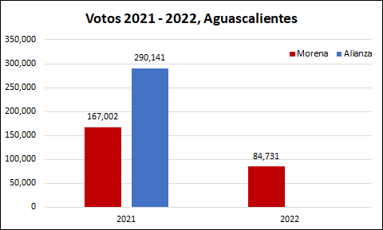
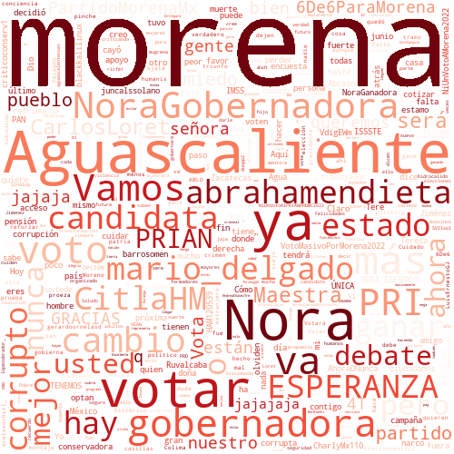
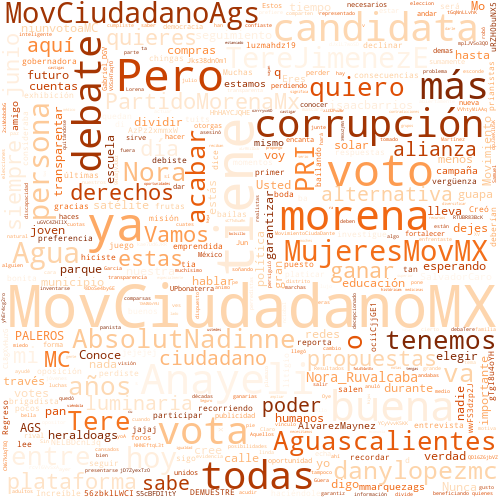
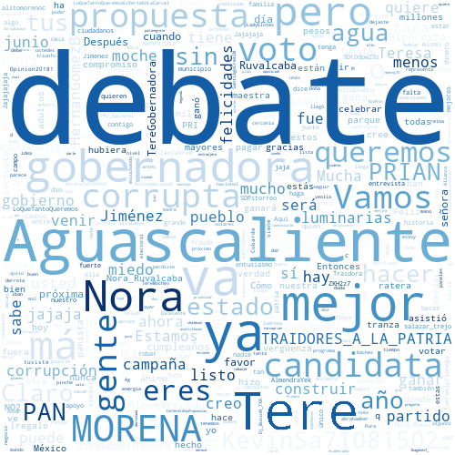

## 1. Introducción

En México, el próximo 4 de junio de 2022 se llevarán a cabo elecciones para gobernador en 6 Entidades de la república mexicana, por lo que quiero hacer algunos análisis de datos, enfocandome principalmente los resultados de los ejercicios electorales más recientes: las elecciones federales del pasado 6 de junio de 2021 y la consulta popular para la revocación de mandato del pasado 10 de abril.

Quiero hacerlo así, para presentar un panorama de lo que pasó, puesto que ambos ejercicios ocurrieron en las 6 Entidades y en ambos pudo participar el 100% del padrón electoral, a pesar de que en la consulta popular participó principalmente el partido Morena, mientras que el resto de los partidos prefirió no participar.

Con este ejercicio, podré ver si el apoyo de las elecciones de 2021 se mantuvo en la consulta de 2022 (para Morena), y analizar los posibles resultados para las elecciones 2022. No obstante lo anterior, este es solo un ejercicio y no considera los mismos resultados de la campaña electoral, el apoyo que pueden atraer los candidatos de manera personal, los cambios en las alianzas o el mismo cambio de preferencia de los electores, para los cuales el mejor análisis es una encuesta, o un resumen de ellas, para lo cual recomiento ampliamente el sitio de [PollsMX](https://www.polls.mx).

Finalmente, aprovechando el análisis de las elecciones, presentó un pequeño análisis de las respuestas que ha tenido cada canditado en Twitter. 

## 2. Elecciones 2021 2022 Aguascalientes

En la elección de 2021, la alianza Va por México obtuvo un mayor número de votos que Morena por un margen casi de 2 a 1. Mientras que para la consulta de revocación de mandato, Morena no avanzó sino que perdió votos. Por tanto, si la alianza logra mantener el número de votos de 2021, es probable que gane las elecciones. Sin embargo, las encuestas de [PollsMX](https://www.polls.mx/elecciones/2022/estado/aguascalientes) anticipan una elección mucho más cerrada.

Al hacer el análisis por sección de los votos en 2021 (elección de diputados federales) contra aquellos de 2022 (consulta de revocación de mandato), se observa que en 2022 hubo menos votos en casi todas las secciones de Aguascalientes:

<iframe
    src='./static/ags.html'
    width='100%'
    height='800px'
    style='border:none;'>
</iframe>

## 3. Twitter Aguascalientes

Si bien, me gustaría analizar a todos los candidatos de la elección para 2022, solo me enforcaré en los 3 primeros lugares de las encuentas de acuerdo con el sitio [PollsMX](https://www.polls.mx/elecciones/2022/estado/aguascalientes). Para evitar sesgos, presentaré a esos 3 candidatos en el orden en que aparecen en dicha página.

### 3.1 Nora Ruvalcaba Gámez

Candidata de Morena a Gobernadora de Aguascalientes. Su cuenta de twitter se puede consultar [aquí](https://twitter.com/Nora_Ruvalcaba). Se encuentra activa en twitter desde 2010, tiene más 16 mil seguidores, con lo que es la segunda con más seguidores, pero sigue a más de 6 mil usuarios con lo que es la que más cuentas sigue en esta red. De acuerdo a las respuestas que tiene, estas son las principales palabras que le responden en Twitter:

### 3.2 Anayeli Muñoz Moreno

Candidata de Movimiento Ciudadano a Gobernadora de Aguascalientes. Su cuenta de twitter se puede consultar [aquí](https://twitter.com/AnayeliMunoz). Se encuentra activa en twitter desde 2011, tiene más 6 mil seguidores y sólo sigue a más de 900 usuarios con lo cual es la candidata con menor actividad en esta red, de las 3 analizadas. De acuerdo a las respuestas que tiene, estas son las principales palabras que le responden en Twitter:

### 3.3 María Teresa Jiménez Esquivel

Candidata de la alianza Va por México (PAN-PRI-PRD) a Gobernadora de Aguascalientes. Su cuenta de twitter se puede consultar [aquí](https://twitter.com/TereJimenezE). Se encuentra activa en twitter desde 2010, tiene más 32 mil seguidores, con lo que es la candidata con más seguidores, pero sólo sigue a más de 1 mil 600 usuarios con lo que es la segunda candidata que más cuentas sigue en esta red. De acuerdo a las respuestas que tiene, estas son las principales palabras que le responden en Twitter:

