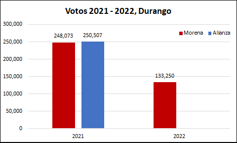
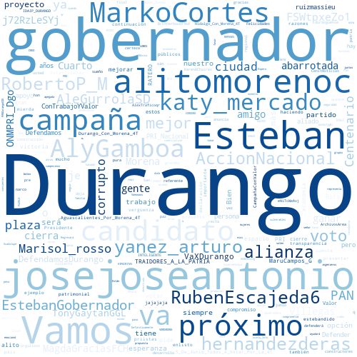
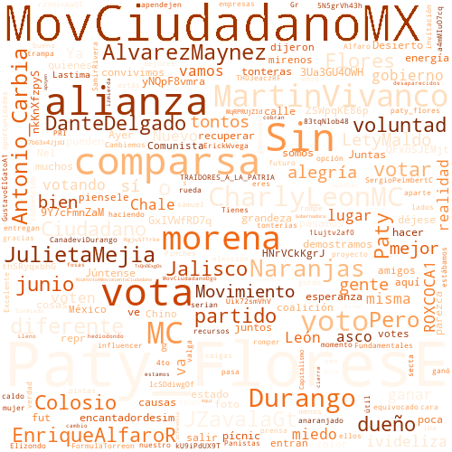

## 1. Introducción

En México, el próximo 4 de junio de 2022 se llevarán a cabo elecciones para gobernador en 6 Entidades de la república mexicana, por lo que quiero hacer algunos análisis de datos, enfocandome principalmente los resultados de los ejercicios electorales más recientes: las elecciones federales del pasado 6 de junio de 2021 y la consulta popular para la revocación de mandato del pasado 10 de abril.

Quiero hacerlo así, para presentar un panorama de lo que pasó, puesto que ambos ejercicios ocurrieron en las 6 Entidades y en ambos pudo participar el 100% del padrón electoral, a pesar de que en la consulta popular participó principalmente el partido Morena, mientras que el resto de los partidos prefirió no participar.

Con este ejercicio, podré ver si el apoyo de las elecciones de 2021 se mantuvo en la consulta de 2022 (para Morena), y analizar los posibles resultados para las elecciones 2022. No obstante lo anterior, este es solo un ejercicio y no considera los mismos resultados de la campaña electoral, el apoyo que pueden atraer los candidatos de manera personal, los cambios en las alianzas o el mismo cambio de preferencia de los electores, para los cuales el mejor análisis es una encuesta, o un resumen de ellas, para lo cual recomiento ampliamente el sitio de [PollsMX](https://www.polls.mx).

Finalmente, aprovechando el análisis de las elecciones, presentó un pequeño análisis de las respuestas que ha tenido cada canditado en Twitter. 

## 2. Elecciones 2021 2022 Durango

En la elección de 2021, la alianza Va por México obtuvo un mayor número de votos que Morena por un estrecho margen. Mientras que para la consulta de revocación de mandato, Morena perdió casi la mitad de los votos. Por tanto, si la alianza logra mantener el número de votos de 2021, es probable que gane las elecciones. Sin embargo, las encuestas de [PollsMX](https://www.polls.mx/elecciones/2022/estado/durango) anticipan una elección mucho más cerrada.

Al hacer el análisis por sección de los votos en 2021 (elección de diputados federales) contra aquellos de 2022 (consulta de revocación de mandato), se observa que en 2022 hubo menos votos en casi todas las secciones de Durango:

<iframe
    src='./static/dgo.html'
    width='100%'
    height='800px'
    style='border:none;'>
</iframe>

## 3. Twitter Durango

Si bien, me gustaría analizar a todos los candidatos de la elección para 2022, solo me enforcaré en los 3 primeros lugares de las encuentas de acuerdo con el sitio [PollsMX](https://www.polls.mx/elecciones/2022/estado/durango). Para evitar sesgos, presentaré a esos 3 candidatos en el orden en que aparecen en dicha página.

### 3.1 Esteban Villegas Villarreal

Candidato de la alianza Va por México (PRI-PAN-PRD) a Gobernador de Durango. Su cuenta de twitter se puede consultar [aquí](https://twitter.com/EVillegasV). Se encuentra activo desde 2011, tiene más 31 mil seguidores, y sigue a más de 5 mil usuarios con lo cual es el candidato más activo en esta red. De acuerdo a las respuestas que tiene, estas son las principales palabras que le responden en Twitter:

### 3.2 Alma Marina Vitela Rodríguez

Candidata de la coalición Juntos Hacemos Historia (Morena-PT-PVEM-RSP) a Gobernadora de Durango. Su cuenta de twitter se puede consultar [aquí](https://twitter.com/MarinaVitelaGP). Se encuentra activa desde 2019, pero su cuenta es privada y solo se puede ver que sigue a 5 usuarios, con lo que prácticamente la candidata no se encuentra activa en esta red social. Debido a que su cuenta es privada no pude obtene las respuestas que tiene la candidata en twitter.

### 3.3 Patricia Flores Elizondo

Candidata de Movimiento Ciudadano a Gobernadora de Durango. Su cuenta de twitter se puede consultar [aquí](https://twitter.com/Paty_FloresE). Se encuentra activa apenas desde 2021, tiene más 1 mil seguidores, y sigue a cerca de 300 usuarios, por lo cual mantiene una baja actividad en en esta red. De acuerdo a las respuestas que tiene, estas son las principales palabras que le responden en Twitter:

