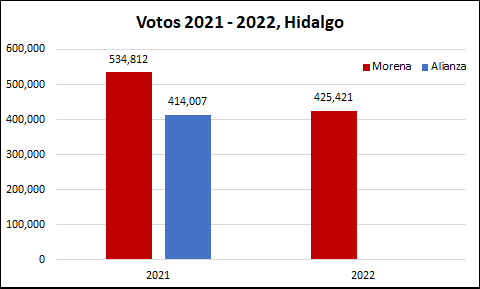
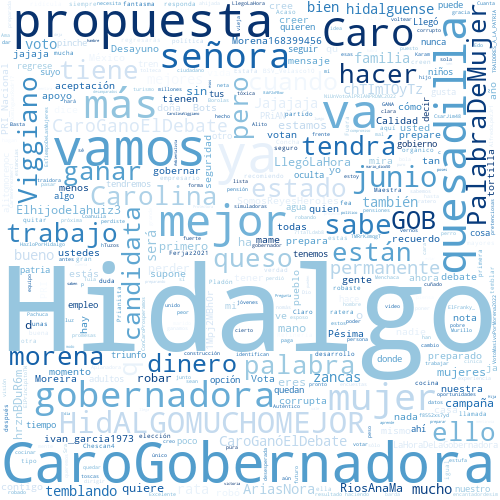
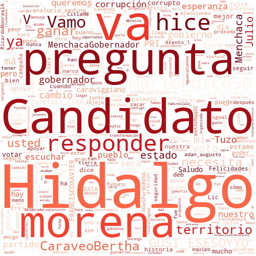
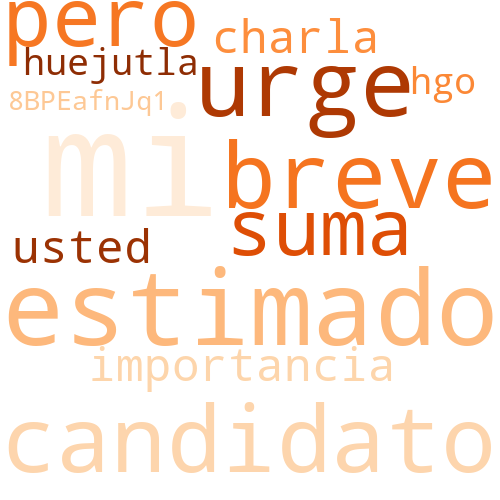

## 1. Introducción

En México, el próximo 4 de junio de 2022 se llevarán a cabo elecciones para gobernador en 6 Entidades de la república mexicana, por lo que quiero hacer algunos análisis de datos, enfocandome principalmente los resultados de los ejercicios electorales más recientes: las elecciones federales del pasado 6 de junio de 2021 y la consulta popular para la revocación de mandato del pasado 10 de abril.

Quiero hacerlo así, para presentar un panorama de lo que pasó, puesto que ambos ejercicios ocurrieron en las 6 Entidades y en ambos pudo participar el 100% del padrón electoral, a pesar de que en la consulta popular participó principalmente el partido Morena, mientras que el resto de los partidos prefirió no participar.

Con este ejercicio, podré ver si el apoyo de las elecciones de 2021 se mantuvo en la consulta de 2022 (para Morena), y analizar los posibles resultados para las elecciones 2022. No obstante lo anterior, este es solo un ejercicio y no considera los mismos resultados de la campaña electoral, el apoyo que pueden atraer los candidatos de manera personal, los cambios en las alianzas o el mismo cambio de preferencia de los electores, para los cuales el mejor análisis es una encuesta, o un resumen de ellas, para lo cual recomiento ampliamente el sitio de [PollsMX](https://www.polls.mx).

Finalmente, aprovechando el análisis de las elecciones, presentó un pequeño análisis de las respuestas que ha tenido cada canditado en Twitter. 

## 2. Elecciones 2021 2022 Hidalgo

En la elección de 2021, Morena obtuvo un mayor número de votos que la alianza Va por México por un margen de 5 a 4. Asimismo, para la consulta de revocación de mandato, Morena mantuvo un número de votos a favor de la permanencia del presidente, por encima de lo alcanzado por la alianza Va por México. Por tanto, si Morena mantiene los votos de la revocación de mandato, es probable que gane las elecciones. De hecho, las encuestas de [PollsMX](https://www.polls.mx/elecciones/2022/estado/hidalgo) apuntan en esa dirección.

Al hacer el análisis por sección de los votos en 2021 (elección de diputados federales) contra aquellos de 2022 (consulta de revocación de mandato), se observa que en 2022 hubo menos votos, pero Morena mantuvo una fuerte presencia territorial:

<iframe
    src='./static/hgo.html'
    width='100%'
    height='800px'
    style='border:none;'>
</iframe>

## 3. Twitter Hidalgo

Si bien, me gustaría analizar a todos los candidatos de la elección para 2022, solo me enforcaré en los 3 primeros lugares de las encuentas de acuerdo con el sitio [PollsMX](https://www.polls.mx/elecciones/2022/estado/hidalgo). Para evitar sesgos, presentaré a esos 3 candidatos en el orden en que aparecen en dicha página.

### 3.1 Francisco Xavier Berganza

Candidato de Movimiento Ciudadano a Gobernador de Hidalgo. Su cuenta de twitter se puede consultar [aquí](https://twitter.com/FRANCISCOXAV1ER). Se encuentra activo en twitter desde 2015, tiene más 3 mil seguidores y sigue a más de 100 usuarios con lo cual es el candidato menos activo en esta red. De acuerdo a las respuestas que tiene, estas son las principales palabras que le responden en Twitter:

### 3.2 Julio Menchaca Salazar

Candidato de Juntos Hacemos Historia (Morena-PT-Nueva Alianza) a Gobernador de Hidalgo. Su cuenta de twitter se puede consultar [aquí](https://twitter.com/juliomenchaca_). Se encuentra activa en twitter desde 2011, tiene más 14 mil seguidores y sigue a más de 300 usuarios con lo cual es el segundo candidato con mayor actividad en esta red. De acuerdo a las respuestas que tiene, estas son las principales palabras que le responden en Twitter:

### 3.3 Carolina Viggiano Austria

Candidata de la alianza Va por Hidalgo (PAN-PRI-PRD) a Gobernadora. Su cuenta de twitter se puede consultar [aquí](https://twitter.com/caroviggiano). Se encuentra activa en twitter desde 2009, tiene más 137 mil seguidores y sigue a más de 2 mil 600 usuarios, por lo cual, es la candidata más activa en esta red. De acuerdo a las respuestas que tiene, estas son las principales palabras que le responden en Twitter:

