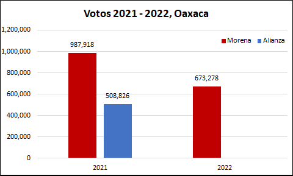
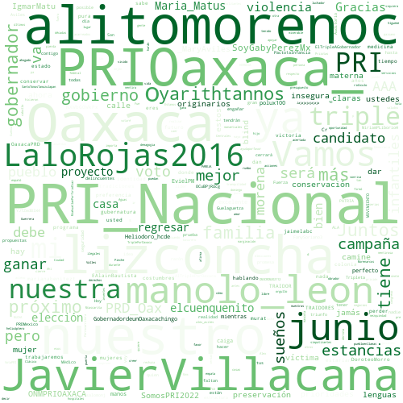
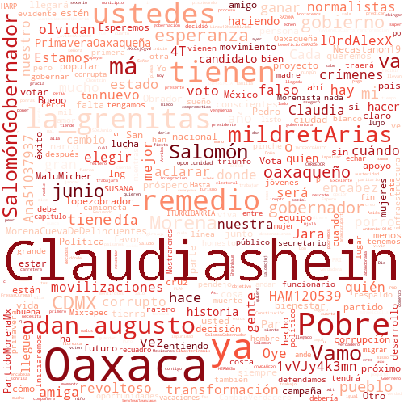
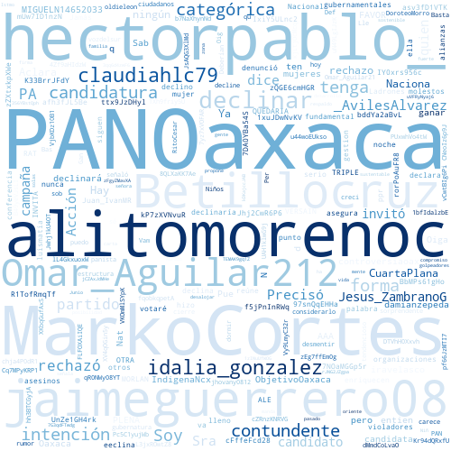

## 1. Introducción

En México, el próximo 4 de junio de 2022 se llevarán a cabo elecciones para gobernador en 6 Entidades de la república mexicana, por lo que quiero hacer algunos análisis de datos, enfocandome principalmente los resultados de los ejercicios electorales más recientes: las elecciones federales del pasado 6 de junio de 2021 y la consulta popular para la revocación de mandato del pasado 10 de abril.

Quiero hacerlo así, para presentar un panorama de lo que pasó, puesto que ambos ejercicios ocurrieron en las 6 Entidades y en ambos pudo participar el 100% del padrón electoral, a pesar de que en la consulta popular participó principalmente el partido Morena, mientras que el resto de los partidos prefirió no participar.

Con este ejercicio, podré ver si el apoyo de las elecciones de 2021 se mantuvo en la consulta de 2022 (para Morena), y analizar los posibles resultados para las elecciones 2022. No obstante lo anterior, este es solo un ejercicio y no considera los mismos resultados de la campaña electoral, el apoyo que pueden atraer los candidatos de manera personal, los cambios en las alianzas o el mismo cambio de preferencia de los electores, para los cuales el mejor análisis es una encuesta, o un resumen de ellas, para lo cual recomiento ampliamente el sitio de [PollsMX](https://www.polls.mx).

Finalmente, aprovechando el análisis de las elecciones, presentó un pequeño análisis de las respuestas que ha tenido cada canditado en Twitter. 

## 2. Elecciones 2021 2022 Oaxaca

En la elección de 2021, Morena obtuvo un mayor número de votos que la alianza Va por México por un margen de 5 a 4. Asimismo, para la consulta de revocación de mandato, Morena mantuvo un número de votos a favor de la permanencia del presidente, por encima de lo alcanzado por la alianza Va por México. Por tanto, si Morena mantiene los votos de la revocación de mandato, es probable que gane las elecciones. Además, de que la alianza compite por separado para la elección a gobernador por lo cual, las encuestas de [PollsMX](https://www.polls.mx/elecciones/2022/estado/oaxaca) apuntan a la victoria de Morena.

Al hacer el análisis por sección de los votos en 2021 (elección de diputados federales) contra aquellos de 2022 (consulta de revocación de mandato), se observa que en 2022 hubo menos votos, pero Morena mantuvo una fuerte presencia territorial:

<iframe
    src='./static/oax.html'
    width='100%'
    height='800px'
    style='border:none;'>
</iframe>

## 3. Twitter Oaxaca

Si bien, me gustaría analizar a todos los candidatos de la elección para 2022, solo me enforcaré en los 3 primeros lugares de las encuentas de acuerdo con el sitio [PollsMX](https://www.polls.mx/elecciones/2022/estado/oaxaca). Para evitar sesgos, presentaré a esos 3 candidatos en el orden en que aparecen en dicha página.

### 3.1 Antonia Natividad Díaz Jiménez

Candidata del PAN a Gobernadora de Oaxaca. Su cuenta de twitter se puede consultar [aquí](https://twitter.com/NatyDiazPAN). Se encuentra activa en twitter desde 2011, tiene casi 8 mil seguidores, y sigue a más de 500 usuarios con lo cual es la candidata con menor actividad en esta red social. De acuerdo a las respuestas que tiene, estas son las principales palabras que le responden en Twitter:

### 3.2 Salomón Jara Cruz

Candidato de Juntos Hacemos Historia en Oaxaca (Morena-PT-PVEM-PUP) a Gobernador. Su cuenta de twitter se puede consultar [aquí](https://twitter.com/salomonj). Se encuentra activa en twitter desde 2009, tiene más 20 mil seguidores con lo cual es el segundo candidato con mayor número de seguidores en esta red, pero sigue a casi 700 usuarios por lo cual es el candidato que más cuentas sigue en esta red. De acuerdo a las respuestas que tiene, estas son las principales palabras que le responden en Twitter:

### 3.3 Alejandro Avilés Álvarez

Candidato de la alianza PRI-PRD a Gobernador de Oaxaca. Su cuenta de twitter se puede consultar [aquí](https://twitter.com/_AvilesAlvarez). Se encuentra activa en twitter desde 2010, tiene más 23 mil seguidores, con lo que es el candidato con más seguidores, pero sólo sigue a más de casi 600 usuarios con lo que es el segundo candidato que más cuentas sigue en esta red. De acuerdo a las respuestas que tiene, estas son las principales palabras que le responden en Twitter:

