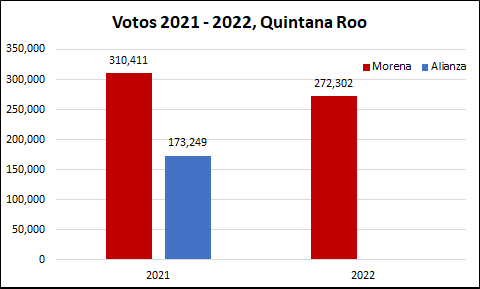
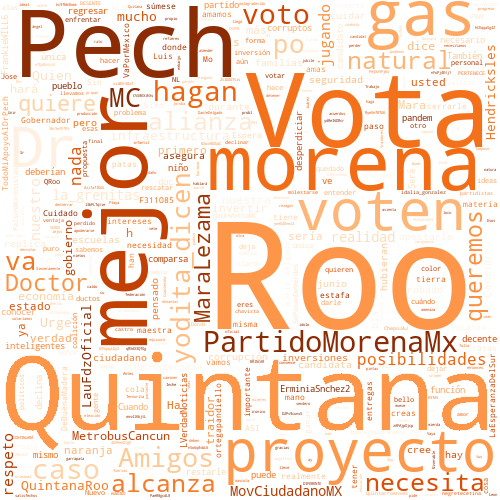

## 1. Introducción

En México, el próximo 4 de junio de 2022 se llevarán a cabo elecciones para gobernador en 6 Entidades de la república mexicana, por lo que quiero hacer algunos análisis de datos, enfocandome principalmente los resultados de los ejercicios electorales más recientes: las elecciones federales del pasado 6 de junio de 2021 y la consulta popular para la revocación de mandato del pasado 10 de abril.

Quiero hacerlo así, para presentar un panorama de lo que pasó, puesto que ambos ejercicios ocurrieron en las 6 Entidades y en ambos pudo participar el 100% del padrón electoral, a pesar de que en la consulta popular participó principalmente el partido Morena, mientras que el resto de los partidos prefirió no participar.

Con este ejercicio, podré ver si el apoyo de las elecciones de 2021 se mantuvo en la consulta de 2022 (para Morena), y analizar los posibles resultados para las elecciones 2022. No obstante lo anterior, este es solo un ejercicio y no considera los mismos resultados de la campaña electoral, el apoyo que pueden atraer los candidatos de manera personal, los cambios en las alianzas o el mismo cambio de preferencia de los electores, para los cuales el mejor análisis es una encuesta, o un resumen de ellas, para lo cual recomiento ampliamente el sitio de [PollsMX](https://www.polls.mx).

Finalmente, aprovechando el análisis de las elecciones, presentó un pequeño análisis de las respuestas que ha tenido cada canditado en Twitter. 

## 2. Elecciones 2021 2022 Quintana Roo

En la elección de 2021, Morena obtuvo un mayor número de votos que la alianza Va por México por un margen importante de casi 2 a 1. Asimismo, para la consulta de revocación de mandato, Morena mantuvo un número de votos a favor de la permanencia del presidente, por encima de lo alcanzado por la alianza Va por México. Por tanto, si Morena mantiene los votos de la revocación de mandato, es probable que gane las elecciones. En ese sentido, las encuestas de [PollsMX](https://www.polls.mx/elecciones/2022/estado/quintana-roo) apuntan a la victoria de Morena.

Al hacer el análisis por sección de los votos en 2021 (elección de diputados federales) contra aquellos de 2022 (consulta de revocación de mandato), se observa que en 2022 prácticamente se mantuvo sin cambios el número de votos:

<iframe
    src='./static/qroo.html'
    width='100%'
    height='800px'
    style='border:none;'>
</iframe>

## 3. Twitter Quintana Roo

Si bien, me gustaría analizar a todos los candidatos de la elección para 2022, solo me enforcaré en los 3 primeros lugares de las encuentas de acuerdo con el sitio [PollsMX](https://www.polls.mx/elecciones/2022/estado/quintana-roo). Para evitar sesgos, presentaré a esos 3 candidatos en el orden en que aparecen en dicha página.

### 3.1 José Luis Pech

Candidato de Movimiento Ciudadano a Gobernador de Quintana Roo. Su cuenta de twitter se puede consultar [aquí](https://twitter.com/DrJLPech). Se encuentra activo en twitter desde 2015, tiene más 9 mil seguidores, con lo cual es el candidato con menos seguidores, pero sigue a más de 3 mil 700 usuarios con lo cual es el segundo candidato que más cuentas sigue en esta red. De acuerdo a las respuestas que tiene, estas son las principales palabras que le responden en Twitter:

### 3.2 Mara Lezama Espinosa

Candidata por la alianza Juntos Hacemos Historia (Morena-PT-PVEM-FXM) en Quintana Roo a Gobernadora. Su cuenta de twitter se puede consultar [aquí](https://twitter.com/MaraLezama). Se encuentra activa en twitter desde 2013, tiene más 48 mil seguidores con los cuales es la candidata con más seguidores, pero sólo sigue a 600 usuarios con lo cual es la candidata que sigue a menos usuarios en esta red. De acuerdo a las respuestas que tiene, estas son las principales palabras que le responden en Twitter:

### 3.3 María Teresa Jiménez Esquivel

Candidata de la alianza Va por Quintana Roo (PAN-PRD-CQR) a Gobernadora. Su cuenta de twitter se puede consultar [aquí](https://twitter.com/LauFdzOficial). Se encuentra activa en twitter desde 2010, tiene más 24 mil seguidores, con lo cual es la segunda candidata con más seguidores, pero sigue a más de 3 mil 800 usuarios con lo que es la candidata que más cuentas sigue en esta red. De acuerdo a las respuestas que tiene, estas son las principales palabras que le responden en Twitter:

