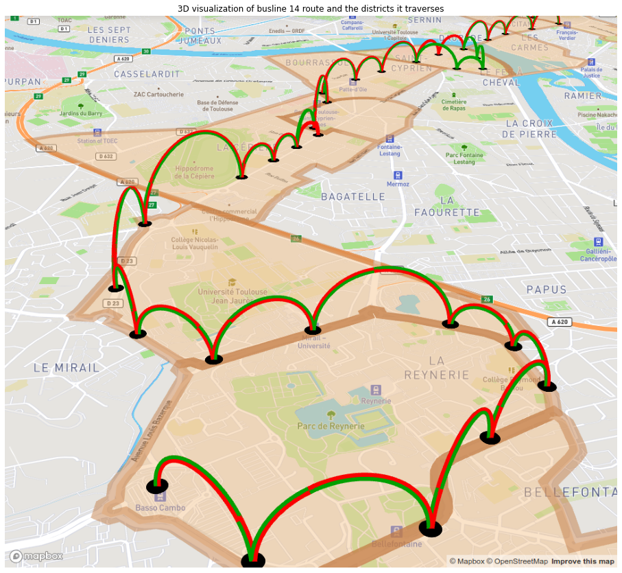

## Mapa de l Optibus

Como me gustan los mapas, me pareció muy interesante encontrar esta notebook, donde se hace [un análisis de la ciudad de Paris](https://nbviewer.org/github/uber/h3-py-notebooks/blob/master/notebooks/urban_analytics.ipynb). De manera muy particular, me pareció interesante replicar el mapa de la ruta 18:

Así que utilizando ese ejemplo y la api de [Mapbox](https://www.mapbox.com), para la cual me regitré hace mucho tiempo, replique el mismo mapa para la ruta 1 troncal de las líneas del [Optibus](https://www.leon.gob.mx/movilidad/articulo.php?a=93) en código HTML:

<iframe
    src='./static/rutas.html'
    width='100%'
    style='border:none;'>
</iframe>