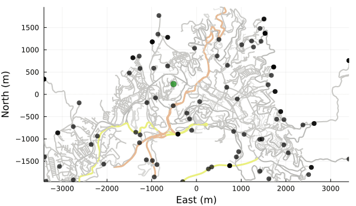

## Un módelo basado en agentes de zombies en Guanajuato

Me gustan las publicaciones breves y sencillas. Este pequeño ejercicio lo hice a partir de un ejemplo de la documentación del paquete "Agents" para el lenguaje de programación Julia:



Usando el ejemplo de la [documentación](https://juliadynamics.github.io/Agents.jl/stable/examples/zombies/), lo adapte para la ciudad de Guanajuato capital. Son 100 puntos que representan personas viajando en Guanajuato, más 1 zombie. ¿Y qué más poético que el primer zombie salga del museo de las momias de Guanajuato? Disfruten:

Besos.
